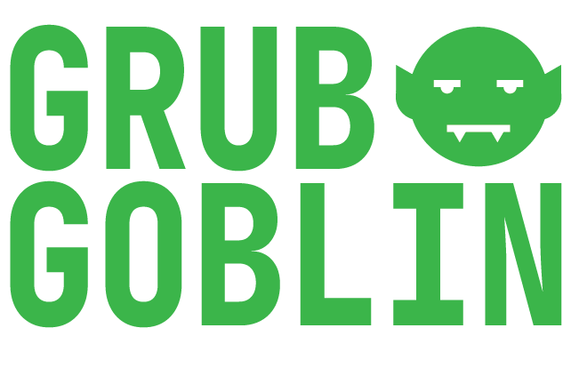

# GRUB GOBLIN

## Description

    
     
    Demonstration video

Grub Goblin is a meal planning app with an emphasis on nutrition. Grub Goblin is designed so that a user can have an entire weeks worth of meals laid out in one easy to ready week long view. All Days are broken down into three meal slots and when food is added to the slots the nutrition is added together and displayed at the under the corresponding day.

Grub Goblin works off of user submitted recipes. Users have the option of entering their own or using an import from URL feature. Whichever way the user chooses the recipe is sent to a third party api and the nutrition information is analyzed.

## Installation

To get the app up and running on your machine follow these steps.

1. Clone repo onto your machine with the `git clone https://github.com/jappelgren/grub-goblin.git` command.
2. Create a database named `prime_app`.
3. Run the `CREATE TABLE` queries in the `database.sql` file.  
   _DO NOT RUN THE INSERT QUERIES YET_
4. Run `npm install` to install all necessary dependencies.
5. `npm run server` to start the server.
6. `npm run client` to start the client.
7. In your browser go to [localhost:3000](http://localhost:3000/).
8. Create a new account using the "Create a New Account" link on login box.
9. After creating an account you are able to run the `INSERT` queries in database.sql if you would like some recipes to play with right away. Otherwise you will be using the app with a clean slate and can add recipes from the add recipe form or import from a url.
10. For nutrition analysis of recipes you will need an API key for the Edamam Nutrition Analysis API. Register for a free account with 200 calls a month [here](https://developer.edamam.com/).  
    _Recipes will not show up on the DOM until they have assigned nutrition information._
11. Once you have the API Key and App Id from Edamam, create a .env file in the root directory of the project and add `APP_KEY=<Your Key>` and `APP_ID=<Your ID>` to it..

## Usage

Grub Goblin is not responsive. It looks best on a 1920x1080 display. If the entire app doesn't fit in the browser frame, press cmd + - until it does. Responsive design is on my list of features to implement in the future.

Before using Grub Goblin, you will need to register an account. Clicking the create new account link will take you to a registration form. AFter registering a user will automatically be logged in and taken to the Grub Goblin dashboard. This is the only view in the app. All recipe entry, nutrition details, etc will appear in modals on top of this view.

Recipes can be entered into the app in one of two ways. Both ways are accessed in the hamburger menu located in the top right of the screen. The first method is recipe entry. A form for the user to fill out will appear in a modal. Recipes need a title, image, ingredients, servings, directions and meal type (Breakfat, Lunch or Dinner). Servings will determine how the nutrition will be divided. All daily nutrition is based on 1 serving.

The second method is importing a recipe from another website. Enter the url of the page that contains the recipe you're looking to import and Grub Goblin's experimental web scraping technology will attempt to import the recipe. This feature is unreliable at the moment but has very good success with a lot of blogs and foodandwine.com recipes.

Once a recipe is in the app and the nutrition is analyzed the recipe will appear in the recipes container at the right side of the screen. Clicking on a recipe will bring up a recipe details modal. In this modal a user can view the recipe itself, the nutrition and are also able to edit the recipe. Any changes to the ingredients of any recipe will trigger Grub Goblin to recalculate the nutrition. Recipes can be favorited and deleted from this view as well.

The recipe container can be searched in the search bar next to the menu icon. Recipes will be searched by title and ingredient. A favorite switch is located on the header of the recipe container. Switching it will show only favorited recipes.

Adding recipes to a meal in a day is as easy as dragging and dropping. When a recipe is dropped onto a meal in the week grid, it's nutrients are added displayed under the day it was dropped onto. If you typically eat a similar thing for any given meal during the week you are also able to drag copies from one meal to another in the week. Recipes can be removed from a meal by clicking the minus icon next to the meal name. All recipes can be wiped from the week if you select clear week from the menu icon in the upper right corner of the app.

## Built With

- [React](https://reactjs.org/)
- [Redux](https://redux.js.org/)
- [Redux-Saga](https://redux-saga.js.org/)
- [PG](https://node-postgres.com/)
- [Node](https://nodejs.org/en/)
- [Express](https://expressjs.com/)
- [React-Router](https://reactrouter.com/)
- [React-DnD](https://react-dnd.github.io/react-dnd/about)
- [React-Spring](https://www.react-spring.io/)
- [Puppeteer](https://pptr.dev/)
- [Edamam API](https://developer.edamam.com/)
